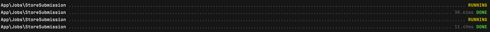
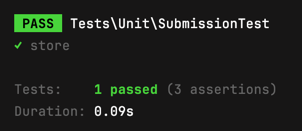

# Test Task

Task was performed using Laravel v.12 and MySQL 9.2.0

## Installation

### Composer

After cloning this repository firstly you need to install all required packages. For that run

```
composer install
```

### Environment variables
After the installation of packages set up your environment like the example (see .env.example). To create environment file, in your project directory use

```
touch .env
```

### Database
Configure your database settings in `.env` file like on the example

```
DB_HOST=127.0.0.1
DB_PORT=3306
DB_DATABASE=test
DB_USERNAME=user
DB_PASSWORD=password
```

If you set everything correctly you can run the migrations

```
php artisan migrate
```

After performing migrations your project is set

### Server
To run server execute 

```
php artisan serve
```
### Worker

To run worker execute 

```
php artisan queue:work
```

## API

To start a job you need to send request to the next endpoint

**POST** `/api/submission`

#### Body
```json
{
    "name": "name",
    "email": "test@gmail.com",
    "message": "My message"
}
```

All parameters are required. In case if something is missing the response will look like

**HTTP:422: Unprocessable entity**
```json
{
    "errors": "The name field is required."
}
```

After successfull request you'll have the response with the same body

**HTTP:200: OK**
```json
{
    "name": "name",
    "email": "test@gmail.com",
    "message": "My message"
}
```

## Jobs

When jobs are running you can see their logs in terminal. 



Also after adding the submissions you can find them in `storage/logs/submissions.log`

`[2025-04-16 09:20:14] local.INFO: Submission saved: new name; test@gmail.com  `

## Testing

To run test execute the following command 

```
php artisan test
```
The result should be like this


